SuperPrism
==========

Loudspeaker diffusion engine for SuperCollider.

SuperPrism was developed with high-density asymmetric speaker arrays in mind, but could be used for any type of setup with discrete speaker/channel assignments.

This project was developed during a residency at [IAC](http://www.iac.lu.se/) in collaboration with [EMS](http://elektronmusikstudion.se/).

Features
--------

* Supports multichannel file input

* Flexible routing scheme
    - Define lists of hardware outputs to create groups of speakers
    - Local FX chains for each speaker group

* Supports custom "diffuser" effects
    - A diffuser is a standard SynthDef which follows a certain I/O scheme (explained below)

* 3-band amplitude analysis to use for sidechaining effect parameters etc.

* Includes a template controller class written for [NanoKONTROL2](https://github.com/davidgranstrom/NanoKontrol2)

Routing scheme
--------------

SuperPrism was designed for high-density speaker arrays. It combines a range of speakers into isolated "diffuser groups" which can be routed through user defined effects. The diffuser groups can contain any number of effects which are assigned locally to each group. This makes custom effect chains possible with dry/wet controls both for individual effects and also for the entire diffuser group.

How to define custom diffusers
------------------------------

Diffusers are synths intended to do processing on a individual speakers. Take a look at `diffusers.scd` to see how it works. The name should correspond to a SynthDef and you should also specify a target group. Groups are defined in `main.scd`.

Keeping the diffusers in separate groups is useful to define the the order of execution of the effects. As it it configured now it works similar to effect chain ins in DAW:s top -> down. If needed you could also create control buses to be able to set the effect parameter and store them between invocations. (The process of adding new diffusers could be automated in the future if needed). 

### I/O Scheme

A diffuser SynthDef should have exactly 1 input and 1 output. Use `XOut.ar` to route the output and define one argument named `drywet` to control the dryness/wetness of the effect and one argument called `bus` which will provide the input/output signal. drywet = 0 would simply bypass the effect (without freeing the synth). Take a look at the existing SynthDefs in `synthdefs.scd` for examples.

---

### Copyright

    SuperPrism
    Copyright (C) 2018 David Granström

    This program is free software: you can redistribute it and/or modify
    it under the terms of the GNU General Public License as published by
    the Free Software Foundation, either version 3 of the License, or
    (at your option) any later version.

    This program is distributed in the hope that it will be useful,
    but WITHOUT ANY WARRANTY; without even the implied warranty of
    MERCHANTABILITY or FITNESS FOR A PARTICULAR PURPOSE.  See the
    GNU General Public License for more details.

    You should have received a copy of the GNU General Public License
    along with this program.  If not, see <https://www.gnu.org/licenses/>.

